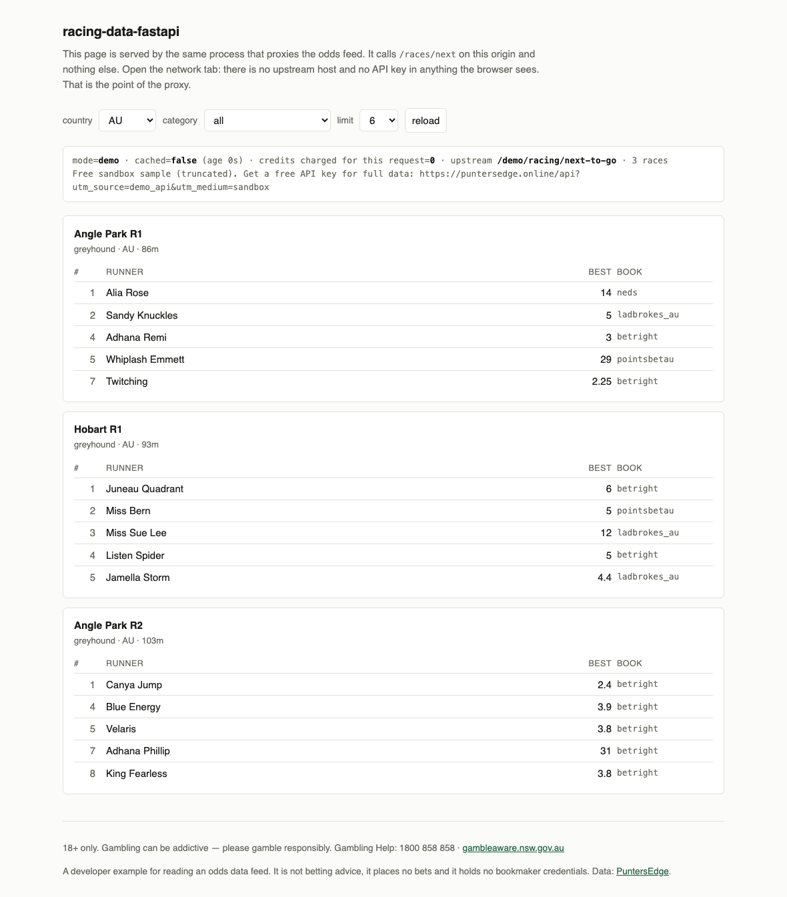

<picture>
  <source media="(prefers-color-scheme: dark)" srcset="docs/logo-dark.svg">
  
</picture>

# Racing data FastAPI backend (Australian odds API proxy)

A FastAPI service that sits in front of the [PuntersEdge](https://puntersedge.online/api?utm_source=racing-data-fastapi&utm_medium=readme)
Australian racing and sports odds API and gives your own frontend a small, cached,
stable contract to call.

It is the reference answer to "I have an odds API key, how do I build a backend on
it" — one shared HTTP connection pool, a TTL cache with single-flight so a hundred
concurrent users cost one upstream call, the upstream key held server-side where the
browser can never see it, and RFC 9457 `problem+json` errors that distinguish "come
back in 37 seconds" from "there is no point coming back". Racing data is Australian
and New Zealand thoroughbred, harness and greyhound; sports are AFL, NRL, NBA and the
rest of the keys listed below.

It runs with **no API key at all** by proxying the keyless PuntersEdge demo endpoints,
so you can start it and see real Australian race prices before deciding whether to
register.

## Run it without an API key

```bash
git clone https://github.com/Propertyscout001/racing-data-fastapi
cd racing-data-fastapi
python3 -m venv .venv && . .venv/bin/activate
pip install -r requirements.txt
uvicorn app.main:app --port 8000
```

Then, in another terminal:

```bash
curl -s 'localhost:8000/races/next?country=AU&limit=2'
```

No key, no signup, no config file. Open <http://127.0.0.1:8000/> for a small HTML
board rendered from the same service, and <http://127.0.0.1:8000/docs> for this
service's own OpenAPI documentation.



Docker, if you prefer:

```bash
docker compose up --build
```

## Real output

`docs/output.txt` is generated end to end by `tools/capture_output.sh`, which starts
and stops every server it needs — keyless, keyed, the error-path stub and the
container. Regenerate it with:

```bash
tools/capture_output.sh > docs/output.txt
```

It captures what it can and says what it cannot: the keyed section is skipped with a
note when `PE_API_KEY` is unset, and the container section is skipped with a note when
no Docker daemon answers. The versions that produced the committed file are pinned in
[`requirements-lock.txt`](requirements-lock.txt).

```
racing-data-fastapi -- real captured output
Generated by tools/capture_output.sh (this whole file, top to bottom)
Captured: 2026-09-15 00:18:27Z UTC
Host: Darwin 24.6.0, Python 3.9.6, uvicorn 127.0.0.1:8000, upstream https://api.puntersedge.online/v1
```

Two things in that file will **not** reproduce byte for byte, and it is worth knowing
which before you compare:

- the races are whatever was next to jump at capture time;
- the keyless demo sample quotes three bookmakers per runner and **rotates which
  three between calls** — observed changing across consecutive requests. So the
  bookmaker rows move even when the race does not. Best-price ties break
  alphabetically by bookmaker key (see `app/normalise.py`), which at least makes
  `best_bookmaker` stable for a given set of prices.

From the keyless run:

```
$ curl -s 'http://127.0.0.1:8000/races/next?country=AU&limit=2'
{
    "source": {
        "mode": "demo",
        "cached": false,
        "cache_age_seconds": 0.0,
        "upstream_path": "/demo/racing/next-to-go",
        "credits_charged": 0,
        "note": "Free sandbox sample (truncated). Get a free API key for full data: https://puntersedge.online/api?utm_source=demo_api&utm_medium=sandbox"
    },
    "count": 2,
    "races": [
        {
            "race_id": "e79e50b1-bc25-4d1d-976c-6b34d0b6426c",
            "venue": "Angle Park",
            "race_number": 1,
            "category": "greyhound",
            "country": "AU",
            "start_time": "2026-09-15T01:38:00Z",
            "runners": [
                {
                    "name": "Alia Rose",
                    "number": 1,
                    "best_price": 14.0,
                    "best_bookmaker": "ladbrokes_au",
                    "prices": [
                        {
                            "bookmaker": "ladbrokes_au",
                            "win_price": 14.0,
                            "place_price": null,
                            "age_seconds": null,
                            "source_url": "https://www.ladbrokes.com.au/racing/angle-park/f9f11182-6bc7-4b23-b9b2-bc4af444f325"
                        },
                        {
                            "bookmaker": "neds",
                            "win_price": 14.0,
                            "place_price": null,
                            "age_seconds": null,
                            "source_url": "https://www.neds.com.au/racing/angle-park/f9f11182-6bc7-4b23-b9b2-bc4af444f325"
                        },
                        {
                            "bookmaker": "playup",
                            "win_price": 14.0,
                            "place_price": null,
                            "age_seconds": null,
                            "source_url": "https://www.playup.com.au/betting/racing/race/236947"
                        }
[... elided: the rest of this race, and the second race ...]
```

That first runner is also the tie-break in action: `ladbrokes_au`, `neds` and `playup`
all quote 14.0, and `best_bookmaker` is the alphabetically first of them rather than
whichever one upstream happened to list first.

`place_price` and `age_seconds` are null here because the keyless demo sample omits
them. With a key they are populated.

## With a free key

Set `PE_API_KEY` and the same routes serve the full feed instead of the truncated
sample. Measured on one race during this capture — Angle Park R1, greyhound,
`e79e50b1-bc25-4d1d-976c-6b34d0b6426c`, 2026-09-15 00:18 UTC:

| | keyless demo | with a key |
|---|---|---|
| runners in that race | 5 | 6 |
| bookmakers per runner | 3 | 14 |
| `place_price`, `age_seconds` | `null` | populated |

Both halves are in `docs/output.txt`, not just asserted here: the keyed capture prints
one runner **complete** — every bookmaker it carries, nothing removed — and then states
the runner and per-runner bookmaker counts for the rest of the race.

Treat 14 as a reading, not a constant. The same race read 11 bookmakers per runner an
hour earlier in the same build: books open their fixed-odds markets at different times,
so the panel fills as the jump approaches. Upstream's `age_seconds` and `refresh_tier`
per bookmaker are how you tell a thin panel from a stale one.

### With a key from the environment

```bash
export PE_API_KEY=your_key_here
uvicorn app.main:app --port 8000
```

### With a key from .env

```bash
cp .env.example .env
$EDITOR .env          # set PE_API_KEY=...
uvicorn app.main:app --port 8000
```

`app/config.py` loads `.env` at import, *before* any setting is read — the settings are
dataclass field defaults calling `os.getenv`, which evaluate once at class-definition
time, so a loader that runs in a startup hook would be too late to do anything. No
`--env-file` flag and no extra step is needed. A real environment variable always wins
over the file.

If the file exists but `PE_API_KEY` in it is empty, startup says so instead of quietly
serving demo data:

```
INFO    proxy mode=demo upstream=https://api.puntersedge.online/v1 ttl_races=20s
INFO    proxy loaded /path/to/racing-data-fastapi/.env
WARNING proxy .env was loaded but PE_API_KEY is empty -- running KEYLESS on the demo
        endpoints. Put a key in that file (PE_API_KEY=...) to serve the full feed.
```

### With a key under Docker

```bash
docker compose up --build
```

`docker-compose.yml` passes `.env` through with `env_file` (marked `required: false`,
so no `.env` is not an error), and an explicit `PE_API_KEY` in your shell overrides it.
All three cases were run: no key anywhere gives `mode=demo`, `.env` alone is picked up,
and a shell variable wins over `.env`.

PART 4 of `docs/output.txt` is the container being built, reported `healthy` by its own
`HEALTHCHECK`, running as uid 10001, and answering a request. Worth saying why that
section exists: the image did **not** build the first time it was run. It created its
unprivileged user with `useradd proxy`, and Debian already ships a system account called
`proxy`, so `useradd` exited 9 and the build failed — a bug that had been sitting in an
"unverified" Dockerfile. The user is `appuser` now.

A free key is 1,500 credits a month with no credit card:
<https://puntersedge.online/api?utm_source=racing-data-fastapi&utm_medium=readme>

What each route costs upstream, per uncached call:

| Route | Upstream endpoint | Credits | Keyless? |
|---|---|---|---|
| `GET /health` | `/v1/demo/racing/next-to-go` | 0 | yes |
| `GET /races/next` | `/v1/racing/next-to-go` | 2 | yes, via `/v1/demo/racing/next-to-go` |
| `GET /races/{race_id}/prices` | *(reads the `/races/next` snapshot)* | 0 | yes |
| `GET /best-odds/{sport}` | `/v1/best-odds/{sport_key}` | 3 | yes, via `/v1/demo/best-odds` |
| `GET /races/{race_id}/history` | `/v1/racing/price-history` | 5 | no, needs a key |

`source.credits_charged` on every response tells you what that specific request cost,
which is `0` on a cache hit.

### Why the cache is the point

`/v1/racing/next-to-go` costs 2 credits. Proxy it one-to-one and 750 page loads spends
a free month — about 25 a day. Put a 20 second TTL in front of it and upstream cost
stops tracking your traffic and starts tracking the clock: 3 calls a minute, whether
one person is watching or ten thousand.

The TTL alone is not enough, because on a cold key every concurrent request checks the
cache before any of them has finished filling it. One `asyncio.Lock` per key collapses
that stampede. Measured against the live API with a real key:

```
$ python3 tools/demo_single_flight.py 25   # keyed: a cache key nothing has asked for
mode                keyed
url                 /races/next?country=AU&limit=16
concurrent requests 25
wall time           427 ms
200 responses       25
credits charged     2  (sum of source.credits_charged across all 25)

misses                4 -> 5    (+1)
coalesced             0 -> 24   (+24)
hits                  2 -> 2    (+0)
upstream_calls        4 -> 5    (+1)
credits_spent         9 -> 11   (+2)
```

Twenty-five simultaneous requests, one upstream call, two credits.

Getting a genuinely cold key is mode-dependent, and `tools/demo_single_flight.py`
checks the mode before it fires. In keyed mode the cache key contains the query
parameters, so a `limit` nothing has asked for is cold by construction. In keyless
mode `/v1/demo/racing/next-to-go` takes no parameters at all, every request shares the
single key `races:demo`, and a second run inside the TTL is all hits and proves
nothing — so the tool waits for that key to expire first and says that it is doing so.

## How it works

**Two upstream shapes, one contract.** The keyless demo endpoints return an envelope,
`{"demo": true, "note": ..., "races": [...]}`. The keyed endpoints return a **bare
array**. Anything supporting both has to handle both, and `app/normalise.py` does it
once so no route and no browser ever has to.

**`country=AU` cuts both ways, and the second cut is the one that hurts.**
`/v1/racing/next-to-go` serves every country it has: measured 2026-09-15 at 00:00 UTC,
an unfiltered `categories=horse` call returned 55 races — 29 AU, 20 GB, 5 US, 1 CA.
Omit the filter and those arrive mixed into whatever your UI is labelling "Australian
racing". But the upstream sets `country` from the *confirmed* meeting, so a race whose
meeting has not been confirmed yet has `country: null` and the same filter throws it
away too — upstream's own parameter documentation puts that at 58.8% of horse races in
a measured window. `country=AU` alone is therefore not "the Australian card", it is the
confirmed slice of it.

So this service sends `include_unresolved=true` by default and exposes it as a query
parameter. Honest caveat: in the window this was built (an Australian morning) *zero*
of the 29 AU horse races were unresolved, so the flag changed nothing I could measure.
It is on by default precisely because the window where it matters is the one you cannot
detect from the response — a short card looks exactly like a quiet day.

**One `httpx.AsyncClient` for the process lifetime.** Built in the lifespan handler,
never per request. Measured from this machine on 2026-09-15 with
`tools/measure_connection_reuse.py`, over 5 cold and 8 warm calls:

```
cold (new client per call, n=5): median  201.1 ms  min  181.7  max  220.4
warm (reused connection,  n=8): median   50.6 ms  min   39.9  max   58.4

reuse saves a median of 150.5 ms per call from here.
```

Your absolute numbers depend on where you are relative to the origin; the ratio is the
part that transfers. `Accept-Encoding: gzip` is set on the same client —
`tools/measure_gzip.py` measured the demo next-to-go payload at 7,025 bytes identity
against 1,460 on the wire, **4.81x**, on 2026-09-15. Quote the ratio rather than the
byte counts: the demo sample varies per call, so the absolute figures are stale by the
next request (4.7–4.8x has held across runs).

**The key never leaves the server.** It is read from the environment in
`app/config.py`, attached to outbound requests in `app/upstream.py`, and appears in no
response body, no log line and no OpenAPI document. Callers of this service
authenticate to it however you like, or not at all — they have no PuntersEdge key and
need none. `app/main.py`'s `strip_client_key` middleware deletes inbound `X-API-Key`,
`Authorization` and `X-RapidAPI-Key` headers at the edge, so no future handler can
start honouring a caller-supplied key and quietly turn this proxy into a credential
relay. The bundled HTML page at `/` makes the boundary visible from the other side:
open the network tab and the only host it talks to is your own.

**402 and 429 are not the same failure.** Both mean the upstream said no, and
collapsing them into a generic 502 destroys the only information a caller can act on.

| Upstream | This service returns | `Retry-After` | `retryable` |
|---|---|---|---|
| 402 credits exhausted | `402` | not sent | `false` |
| 429 rate limited | `429` | forwarded from upstream | `true` |
| 401 / 403 | `502` | not sent | `false` |
| 5xx | `502` | not sent | `true` |
| timeout | `504` | not sent | `true` |

401 becomes 502 deliberately: the caller has no key to fix, so returning 401 to them
would be a lie about whose problem it is. Reproduce the whole table with no upstream
account using the bundled stub, which is stdlib-only:

```bash
python3 tools/stub_upstream.py 402 &
PE_API_KEY=not-a-real-key PE_UPSTREAM_BASE=http://127.0.0.1:8099/v1 \
  uvicorn app.main:app --port 8000
curl -i 'localhost:8000/races/next?limit=2'
```

**Nothing is retried automatically, and nothing pretends to be fresh.** A silent retry
on a price endpoint can return a quote recorded before a move. The same rule applies to
the cache: `/races/{race_id}/prices` answers out of the snapshot `/races/next` already
paid for, and every entry in that index carries the time it was stored, back-dated by
the age of the snapshot it came from. Past `CACHE_TTL_RACES` it is a miss and the
service goes back upstream. An index without that timestamp reports
`cache_age_seconds: 0.0` over an hour-old price, which is the same failure as a silent
retry wearing better clothes.

**Failed fetches are not cached**, so one bad minute upstream does not become twenty
seconds of stored error for every caller. `/health` reports `upstream_calls` and
`upstream_errors` separately, and `misses == upstream_calls + upstream_errors`.

**Unknown sport keys are refused locally — for the answer, not the cost.** There is no
`horse-racing` sport key; racing lives under `/races/*`. Upstream documents that an
unknown `sport_key` returns 404 and *costs nothing*, so forwarding a typo is free. The
local allowlist buys a 400 that **names the twenty valid keys**, one round trip sooner
than a bare 404 that names none. The price of that is a local snapshot going stale, so
`PE_EXTRA_SPORT_KEYS=padel,darts` adds keys at runtime when PuntersEdge adds a sport.

## Repository layout

```
app/
  config.py      env settings and .env loading, the only place the key is read
  upstream.py    the single AsyncClient, and the status mapping table
  cache.py       TTL + single-flight, sweep-on-use eviction, credit arithmetic
  normalise.py   demo envelope vs bare array, folded into one shape
  models.py      response models -- narrower than upstream on purpose
  routers/       races, best_odds, health
  static/        the HTML board served at /
tools/
  stub_upstream.py            a failing upstream, for the error paths
  demo_single_flight.py       proves N concurrent = 1 upstream call
  measure_connection_reuse.py reproduces the latency numbers above
  measure_gzip.py             reproduces the compression ratio above
  capture_output.sh           regenerates ALL of docs/output.txt
docs/
  output.txt      the real captured session, generated by capture_output.sh
  openapi.json    this service's own spec
  screenshot.png  the HTML board at /
  demo-page.html  a self-contained render of that board (clone and open it;
                  GitHub serves .html in docs/ as source, not as a page)
```

## Limitations

- **Not a general proxy.** Five routes over four upstream endpoints. PuntersEdge
  publishes 60 paths; results, movers, acceptances, jockey and trainer stats,
  arbitrage and the CSV exports are all absent. Add them by copying a router.
- **In-process cache only.** A `dict` in one process. Run two replicas and you get two
  caches and twice the upstream calls. For a real deployment put Redis behind the
  `TTLCache` interface — the single-flight lock would need to become a distributed
  lock too.
- **No authentication on this service.** Anyone who can reach it can spend your
  credits. Put it behind your own auth, or on a private network, before exposing it.
- **No memory bound, only sweep-on-use eviction.** `TTLCache.sweep()` runs at the top
  of every `get_or_fetch` and drops expired entries plus any lock nobody holds; the
  race index is capped at 2,000 entries, oldest evicted first. Nothing runs on a timer,
  so an idle process holds whatever it last had until the next request.
- **The keyless demo tier allows 30 requests/minute per IP.** `/health` probes the
  upstream, so an uncached probe would make liveness-probe frequency set upstream
  request volume — a 5s probe is 12/min of that budget, and tripping the limit makes
  the service report itself `degraded` for a self-inflicted 429. The probe result is
  therefore cached for 10 seconds (`upstream_probe_cached` and
  `upstream_probe_age_seconds` say so on every response). I still tripped the limit
  twice by hand while testing this repo.
- **Demo mode ignores your filters upstream.** `/v1/demo/racing/next-to-go` takes no
  parameters and returns a fixed handful of Australian races — greyhound races
  throughout this build. `country`, `limit` and `category` are applied locally to
  whatever that sample contained, so a demo-mode request for harness races
  legitimately returns nothing. The HTML board says this on the page rather than
  showing a bare "no races matched".
- **`credits_remaining` is usually `null`.** `/v1/usage` returned HTTP 500 for the key
  used during this build while every data endpoint answered normally, so the field is
  best-effort and cannot turn the health check red. It may populate with other keys.
- **Price history needs a key and a finished race.** `/v1/racing/price-history` returns
  404 for a race that has not jumped — history is written once the market closes.
  Verified 2026-09-15 across greyhound, harness and thoroughbred races.
- **`/races/{race_id}/prices` only covers currently quoted races**, because it reads
  the same snapshot `/races/next` fetched. Once a race jumps it leaves that window;
  use `/races/{race_id}/history`.
- **No tests.** The build machine had no pytest. `tools/` holds runnable checks
  instead, which is not the same thing. `requirements-lock.txt` pins the exact versions
  the capture was taken on, because there is no test suite to catch the morning a new
  FastAPI or Pydantic major breaks the one documented command.
- **The 402 path is proven against a stub, not production.** Triggering a real 402 means
  exhausting a credit allowance. `tools/stub_upstream.py` stands in for it. The 429 path
  *was* proven against the live API — the keyless tier's limit is easy to trip by hand,
  and I tripped it twice.
- **Bookmaker coverage is whatever the upstream serves**, and it changes. This README
  quotes no coverage count; the live list is at
  <https://puntersedge.online/coverage-report?utm_source=racing-data-fastapi&utm_medium=readme>.
  Betfair and Pinnacle are not included.

## Related

PuntersEdge guides:

- [Getting started](https://puntersedge.online/developers/getting-started?utm_source=racing-data-fastapi&utm_medium=docs)
- [API reference](https://puntersedge.online/developers/api-reference?utm_source=racing-data-fastapi&utm_medium=docs)
- [Australian odds API Python guide](https://puntersedge.online/blog/australian-odds-api-python-guide?utm_source=racing-data-fastapi&utm_medium=docs)
- [Betting model data pipeline in Python](https://puntersedge.online/blog/betting-model-data-pipeline-python?utm_source=racing-data-fastapi&utm_medium=docs)

Sibling repositories:

- [puntersedge-python](https://github.com/Propertyscout001/puntersedge-python) — the official Python SDK
- [puntersedge-node](https://github.com/Propertyscout001/puntersedge-node) — the Node SDK
- [puntersedge-mcp](https://github.com/Propertyscout001/puntersedge-mcp) — MCP server for LLM tooling
- [puntersedge-examples](https://github.com/Propertyscout001/puntersedge-examples) — standalone single-file Python scripts
- [au-racing-odds-dashboard](https://github.com/Propertyscout001/au-racing-odds-dashboard) — one stdlib-only file, no framework

## Sport keys

`afl` `aflw` `nrl` `nrlw` `nba` `wnba` `nfl` `ncaaf` `mlb` `nhl` `mma` `tennis_atp`
`tennis_wta` `cricket_test` `cricket_other` `rugby_union` `super_league` `soccer_epl`
`soccer_other` `basketball_other`

Snapshot taken 2026-09-15 from <https://api.puntersedge.online/openapi.json>. Racing is
not a sport key. It lives under `/races/*`, covering Australian thoroughbred, harness
and greyhound racing, and New Zealand thoroughbred and harness.

## Licence

MIT. See [LICENSE](LICENSE).

---
18+ only. Gambling can be addictive — please gamble responsibly.
Gambling Help: 1800 858 858 · https://www.gambleaware.nsw.gov.au
This repository is a developer example for reading an odds data feed. It is not betting
advice, it places no bets and it holds no bookmaker credentials.
